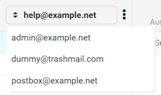
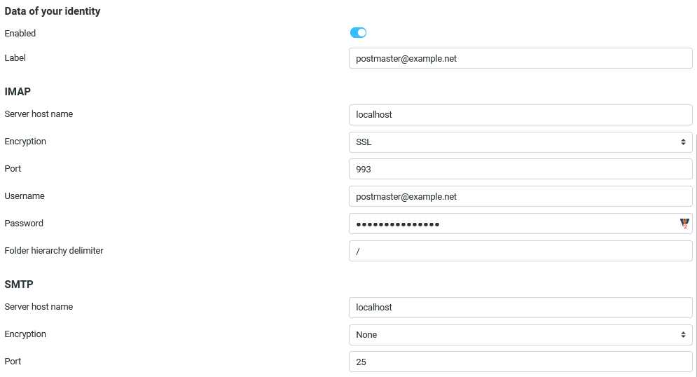
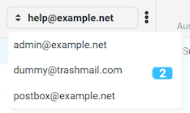

# Identy switch plugin for Roundcube

This plugin is based on the  plugin. It is completly rewritten and additional features has been added.

This plugin allows users to switch between different accounts in single Roundcube session like this:

### Where to start ###
* In settings interface create new identity.
* For all identities except default you will see new section of settings - "Data of your identity" (see screenshot below). Enter data required to connect to  remote server. Don't forget to check **Enabled** check box.
* After you have created at least one identity with active plugin you will see combobox in the top right corner instead of plain text field with account name. It will allows you to switch to another account.

### Settings ###

* **Enabled** - Enables plugin (i.e. account switching) for this identity.
* **Label** - Text that will be displayed in drop down list for this identity. 
* **IMAP**
    * **Server host name** - Host name for imap server. If left blank 'localhost' will be used.
    * **Encryption** - Enabled secure connection (TLS or SSL).
    * **Port** - Port on server to connect to. If left blank 143 will be used.
    * **Username** - Login used *for IMAP and SMTP servers*.
    * **Password** - Password used *for IMAP and SMTP servers*. It's stored encrypted in database.
* **SMTP**
    * **Server host name** - Host name for imap server. If left blank 'localhost' will be used.
    * **Port** - Port on server to connect to. If left blank 587 will be used.
    * **Authorization** - Select if same security should be used as for IMAP.
    
### Settings for active identity ###

If you've selected an identity (or use the default identity), you may change settings for new-mail check cycle in `Settings` -> `Preference` -> `User Interface`.

If you've selected an identity (or use the default identity), you may change settings for notification settings in `Settings` -> `Preference` -> `Mailbox view`.

### Additional settings ###

* **Check all folders...** - Select this option, if you want all folders to be check for new mails. 
* **Display browser notification...** - Select this option, if you want to get a changed icon for this site. Please be aware, that the icon will change only one time, even if there a new mails for multiple identities available (until next new-mail check-cycle is started).
* **Display desktop notification...** - Select this option, if you want to get a desktop notification about how many new mails were available. Please be aware, you need to allow your mail server site in your browser configuration to send notifications to your desktop.
* **Close desktop notification** - Specify how many seconds should be visible before it is automatically been closed.
* **Play sound...** - Select this option, if you want a sound notification. Please be aware, that only sound will be played one time only, even if there are new mails for multiple identities available (until next new-mail check cycle is started). If you hear no sound playing, please check your browser settings, if auto-play of sound files is enabled.
* **Refresh...** - Specify the new-mail check cycle in minutes.

If you receive new mails, the number of new mails will be shown in identity selection menue.

### Pre-configuration ###

There is a file `config.inc.php` available. This file can be used to specify some configuration settings.

If you want to change sound, icon or desktop icon, please checkout `alert.mp3`, `alert.wav`, `alert.ico` and `alert.gif` in sub-directory `assets`.

### Performance ###

New mail checking is performed in background asynchronously. This has the effect that the new mail counter is not always updated immediately after login - it may take some time before this has been performed. It heavily depends on the number of identities you're using.

If you've select **Check all folders**, this has a huge impact on the time new-mail checking need to collect information. If you have hundreds of folders in your mail box, each of the boxes will be check for new mails.

Please don't forget to set `Special Folders` in `Settings` -> `Preferences`. All folders specified there (and their sub-folders) will be excluded from new-mail checking.

### Version compatibility ###

* Versions 1.x - for Roundcube v1.6. Requires PHP version >= 8.0.0.

### License ###

This plugin is released under the [GNU General Public License v3.0](./LICENSE).

### Donation ###

If you like this software and you want support my work, feel free to send me a donation:

